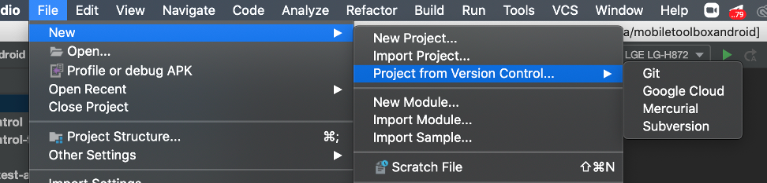
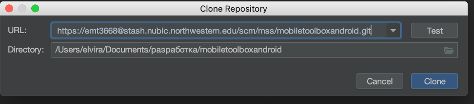
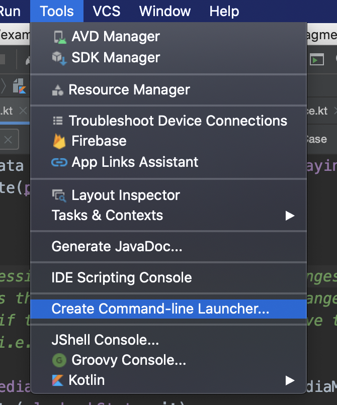

# MotorControl-Android

A set of active tasks for measuring Motor Control

# Steps for setting up a project on your computer:

### Download project:

- Select Clone repository:
- Copy https link and go to Android studio
- Select File-> New -> Project from VC -> Git
  
- Put link in the URL field and choose directory where you want to store the project. Select clone.
  
- Download mobiletoolbox project (you can repeat previous steps of downloading project)

### Open Terminal

- Download homebrew. Instruction can be found [here](https://brew.sh/)
- Run in terminal

```sh
brew install wget direnv
```

- Run the Swift Android Toolchain installer script.

```
./scripts/swift-android-toolchain-installer.sh
```

### Swift Android Toolchain setup

- Edit or create the `local.properties` to have the following properties:

```
ndk.dir=/Users/<your mac username>/.android-swift/android-ndk-r17c
swift-android.dir=/Users/<your mac username>/.android-swift/swift-android-5.0-r13
```

- Copy `.envrc.sample` to `.envrc` to allow the export of the `$TOOLCHAINS` environmental variable that will switch the version of Swift to the 5.0.3 toolchain within this directory.

```
mv .envrc.sample .envrc
```

- Tell `direnv` to allow this new `.envrc` and execute it:

```
direnv allow .
```

### Setup Android Studio

- If you don't have it already, create a command line launcher for Android Studio from the app menu in `Tools > Create Command-line Launcher`:

  

- Quit Android Studio, navigate to the `mobiletoolboxandroid` project in your terminal shell, and launch Android studio with the command line launcher:

```
studio .
```

### You will be able to run the project. Happy coding!
