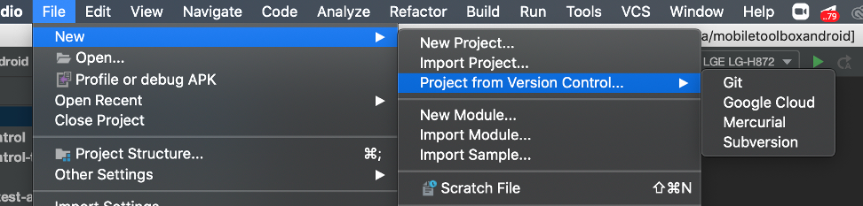
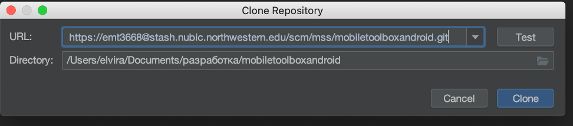

# MotorControl-Android
A set of active tasks for measuring Motor Control


# Steps for setting up a project on your computer:
### Download project:
- Select Clone repository:
- Copy https link and go to Android studio
- Select File-> New -> Project from VC -> Git

- Put link in the URL field and choose directory where you want to store the project. Select clone.

- Download mobiletoolbox project (you can repeat previous steps of downloading project)

### Open Terminal
- Download homebrew. Instruction can be found [here](https://brew.sh/)
- Run in terminal
```sh
brew install wget
```
- You will need to have swift-android-toolchain-installer.sh  script. Ask from your co-workers
Save this script and run
```sh
chmod ugo+x swift-android-toolchain-installer.sh
./swift-android-toolchain-installer.sh (edited)
```

### Go to android studio and rebuild project.

### You will be able to run the project. Happy coding!
